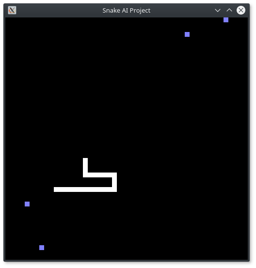

**Feel free to edit this file (open in atom and ctrl + shift + M to open a [markdown](https://github.com/adam-p/markdown-here/wiki/Markdown-Cheatsheet) preview)**
## Snake AI

**Written and developed for CMSC 471 project.**

---

## Outline

The goal is to get a machine to play snake to perfection through AI techniques and learning algorithms.

1. Setup game
2. Neural networks
3. ???
4. Profit

---

## Basic Game Engine

So far the game is as simple in design as possible, utilizes openGL. Followed the tutorial at https://noobtuts.com/python/snake-game with minor changes to __keyboard( )__ and __vec_add( )__ functions to have it working properly.

#### TODO
Add Boundaries
Restrict movement backward
Death on collision

---

## New to git

The guide on [Atlassian](https://www.atlassian.com/git/tutorials/learn-git-with-bitbucket-cloud) is thorough and easy to follow
Lots of good tutorials that break it down in detail. Here are the basics for quick reference:

1. git clone https://jfield0@bitbucket.org/slysnake9/code.git

 Makes .git folder and copies the entire repository and sets pushing to.

2. git init

 Creates a .git folder that stores files to handle all the changes to be made. If you want to stop tracking a folder just delete this folder and you can start again.

3. git remote add -m https://jfield0@bitbucket.org/slysnake9/code.git

 Sets the repo you want to connect to.

4. git remote -v

 To see what repo you are remotely connected to, **https://jfield0@bitbucket.org/slysnake9/code.git** in this case.

### For a typical workflow
#### Save and upload
1. git status

 In case you want to see what changed, you can also view the file in .git

2. git add .

 Adds all changes that git to track.

3. git commit -m "Description of changes"

 records to staging area (build you are getting ready to push) the current state of tracked files.

4. git push

 Brings remote repo up to date with your's.

5. git stash

 Saves your version in a stash to allow downloading other versions without losing your changes.

#### Download

5. git pull

 Combination of **git fetch** and **git merge origin/master**. Brings your local repo up to date with the connected repo.

6. git checkout branchname

 Switch between versions of code. Can be used to go back to old commits. Can also go to different branches, switching your head to that branch so your changes now are applied there.

7. git checkout -b new-branch

 Create a new branch and immediately switch to it.

 **More on branches and git can be looked up, Atlassian has a good** [guide](https://www.atlassian.com/git/tutorials/using-branches/git-checkout)

---

## Clone repository

Use these steps to clone from SourceTree, our client for using the repository command-line free. Cloning allows you to work on your files locally. If you don't yet have SourceTree, [download and install first](https://www.sourcetreeapp.com/). If you prefer to clone from the command line, see [Clone a repository](https://confluence.atlassian.com/x/4whODQ).

1. You’ll see the clone button under the **Source** heading. Click that button.
2. Now click **Check out in SourceTree**. You may need to create a SourceTree account or log in.
3. When you see the **Clone New** dialog in SourceTree, update the destination path and name if you’d like to and then click **Clone**.
4. Open the directory you just created to see your repository’s files.

Now that you're more familiar with your Bitbucket repository, go ahead and add a new file locally. You can [push your change back to Bitbucket with SourceTree](https://confluence.atlassian.com/x/iqyBMg), or you can [add, commit,](https://confluence.atlassian.com/x/8QhODQ) and [push from the command line](https://confluence.atlassian.com/x/NQ0zDQ).
